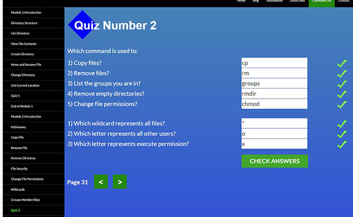

# kottans-frontend
## Linux CLI, and HTTP

Для мене новими були команди pwd та more (отримання інформації про файл).

Корисна інформація про місцезнаходження і файл. 

Цікава команда chmod для встановлення дозволів для файлів

Майже всі команди для мене були новими. 

Man для пошуку документацыъ про команди. find для пошуку файлів та інформації у них.

Новим для мене були позначення домашньої "~" та "." поточної директорії

Новими були команди отримання інформації про місце на диску та команди зупинки та примусової зупинки процесу.   
Оримав нові знання про HTTP, процес передачі інформації, коди, формат HTTP-повідомлень, як відбувається ідентифікація та автентивіуація, гешування.

## Intro to HTML and CSS

Пройшовши курс HTML та CSS, вдосконалив свої знання, здобуті раніше. Більш впевнено почав робити верстку макетів.